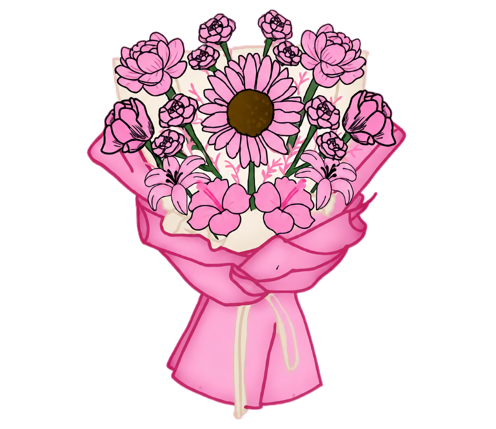

<!DOCTYPE html>
<html lang="en">
<head>
<meta charset="UTF-8">
<meta name="viewport" content="width=device-width, initial-scale=1.0">

<link href="https://fonts.googleapis.com/css2?family=Parisienne&family=Poppins:wght@300;400;600&display=swap" rel="stylesheet">

<title>For My Baby ❤️</title>

</head>

<body>

<!-- PAGE 1 -->

    <h1 class="title">
        Hi my baby :33
    </h1>

    

    

        Touch the flower 🌸 (0/3)
    

<!-- PAGE 2 -->

    <h1 class="title" style="font-size:2.2rem;">
        May I ask something?
    </h1>

    

        <button
            class="yesBtn"
            onclick="goPage3()">
            Yes
        </button>

        <button
            id="noBtn"
            class="noBtn"
            onclick="pressNo()">
            No
        </button>

    

    

<!-- PAGE 3 -->

    <h1 class="title" style="font-size:2.2rem;">
        May I court you?
    </h1>

    

        <button
    class="yesBtn"
    onclick="goPage4()">
    Yes
    </button>

        <button
            id="noBtn2"
            class="noBtn"
            onclick="pressNo2()">
            No
        </button>

    

    

<!-- PAGE 4 -->

    <h1 class="title" style="font-size:2rem;">
        Yayyy. Please read this, baby ❤️
    </h1>

    

        

    

    Hi baby ^^ I want to say thank you, thank you for giving me a chance to be your suitor.

      

    I will use this chance to prove myself to you, that I am worthy of your love and also prove that you're worthy of being pursued.

      

    I won't waste any moment to make you feel loved, heard, and seen. I will love you the same way Tita does. I'll love every inch of you, no matter what version it is that you show to me.

      

    I will listen to everything that you yap to me about, no matter how random or small you think it is.

      

    You matter, baby.

      

    I've heard everything you've told me—from your favorites, insecurities, dislikes, likes, traumas, and even the things that you thought didn't matter.

      

    I still remember all of those, baby. Because remembering and understanding you more means keeping you closer into my heart and making you a part of me.

      

    I'll never get tired of understanding you, may I be tired myself or drained. As understanding you means that I'm always understanding myself.

      

    You are my baby, my wife, and someone that I would spend eternity with.

      

    You've bewitched my body and soul, my baby. You took me as a whole, you took me like I was something that originally belonged to you.

      

    And maybe that was true. Maybe we originally belonged to each other in our past lives. It only took us some time to find each other again because we wouldn't be able to love each other as a whole if we didn't get to know ourselves first.

      

    I will never leave you, my baby.

      

    No matter how tough things will be, you will never see me give up on us.

      

    That is something that I would stake my life on.

      

    That I will love you unconditionally and beyond.

      

    I'm sorry if sometimes I was too much, that I kept asking you the same thing or kept trying to talk to you even if you didn't want to.

      

    I don't want you to feel alone.

      

    Please bear with me, baby.

      

    I'm still trying to learn the best way to love you, to love you in a way that you'll feel the most.

      

    I will never ever get tired of knowing you more.

      

    You will always be my baby, and I will never let anyone get close to me again.

      

    I will do everything with you, only you.

      

    There wouldn't be a purpose in doing things I find fun with somebody else. I already have you.

      

    I'll love you to the point that everyone who sees me will remember you, because I want you to be engraved in everyone's mind that you are my baby.

      

    Lastly, I can promise you that no matter what happens, you will still be my baby at the end of the day.

      
    I love you so much, my baby. Ill always be proud of you no matter what. Mwaa

       

    <b>
    — Your Husband, Carlo ❤️
    </b>

    

    

</body>
</html>
